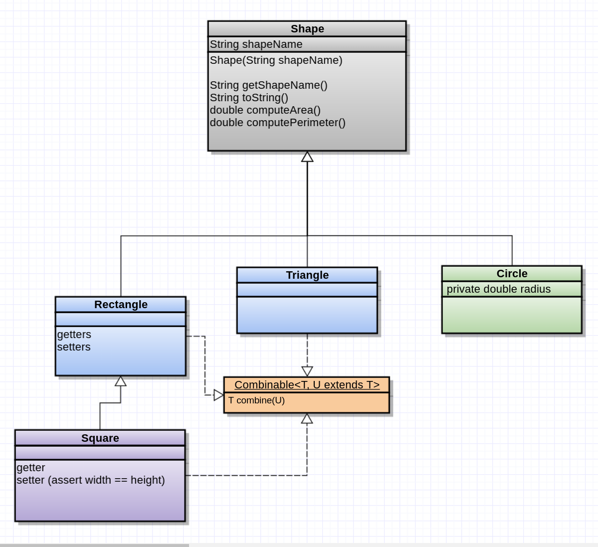

# Lab Assignment 6
## Inheritance and Interfaces with Shapes

### Table of Contents 

[Problem Description](#problem-description)

[Requirements](#requirements)

[Design Specifications](#design-specifications)

[Deliverables](#deliverables)

[Working on the Assignment](#working-on-the-assignment)

### Problem Description

This lab combines the concepts of inheritance, interfaces, polymorphism, and generic types. You are given a semi-implemented hierarchical class structure. Your task is to complete the implementation by creating the remaining subclasses and implementing any remaining methods.



The classes relate to basic geometric figures. They have properties such as length, width, area, and shape. Some shapes have more in common than other shapes. These commonalities are described by either inheritance, interfaces, or both.

As an example, the area of any of our shapes can be computed. However, the properties needed to calculate their shapes differ. A rectangle's area is calculated from its length and width whereas a circle uses its radius.

Inheritance is not always the best way to describe sets of common features. For example, some of our shapes can be combined to form larger versions of themselves. Two equal sized squares can be combined in a rectangle.  Some triangles can even be combined into a rectangle. Circles, however, can never be combined into any kind of quadrilateral. Furthermore, some classes which are not Shapes at all could conceivably be combined in meaningful ways. Interfaces are an excellent way to handle these kinds of abstract behaviors.

### Requirements

You are given an abstract class, ```Shape```, and two mostly-implemented subclasses, ```Rectangle``` and ```Triangle```. There is also a ```Combinable``` interface which some of the subclasses must implement. Your task is to:

1. Create two new subclasses, ```Circle``` and ```Square```, and implement their inherited methods (if they differ from their superclass).
2. Implement the Comparable interface. Compare shapes by their **AREAS**.
3. For a BONUS, implement ```combine()``` method for classes which have the ```Combinable``` interface.

### Design Specifications
The starting code and UML diagram provide the design specifications. Do not change any class names or public methods.

### Deliverables

Each student is to complete the assignment individually, however you may discuss ideas with others.

To submit your code, push your code back to your lab 6 Github repository. For each submission, you will receive an email containing the results of my secret JUnit tests. Your grade will be based on your last push prior to the deadline. You may submit your code multiple times prior to the deadline.

#### Submission Deadline

This assignment is due in one week prior to the start of the next lab.

### Working on the Assignment
Tips:
https://en.wikipedia.org/wiki/Heron's_formula

Refer to the previous labs' (3 and 4) readme files for how to import from Github and upload back.
